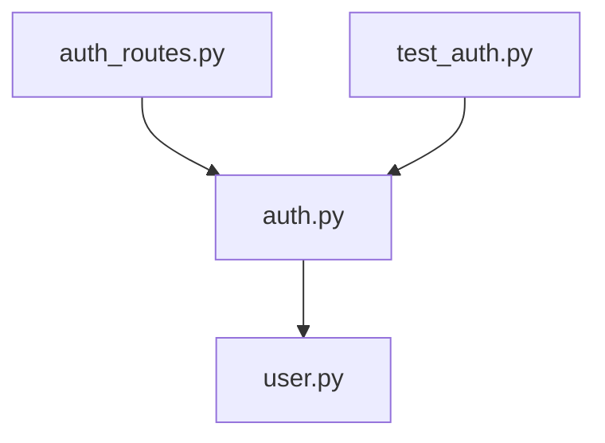

# trace-code-context Reference

Reference guide for the `trace-code-context` skill — covering extraction hierarchy, per-language patterns, output conventions, and subagent guidance.

---

## Extraction Hierarchy

Symbol and import extraction follows this priority order:

1. **`ctags`** (if `shutil.which("ctags")` returns a path) — universal, language-agnostic, highest accuracy. Only used if ctags returns non-empty results.
2. **`ast`** (Python only) — standard library, fully reliable, parses `FunctionDef`, `AsyncFunctionDef`, `ClassDef`, `Import`, `ImportFrom`.
3. **`java-regex`** — structured Java regex for types (`class`/`interface`/`enum`/`record`) and method signatures.
4. **`js-regex`** — regex for exported/top-level `function`/`class`/`const` plus `import from` and `require()`.
5. **`go-regex`** — regex for `func` declarations (including methods), `type` declarations, and block/single `import` statements.
6. **`regex-fallback`** — generic keyword regex (`function`, `def`, `class`, `func`, `sub`) for all other languages.

The `parse_method` field in the JSON output indicates which method was used.

---

## Per-Language Caller Grep Patterns

When searching for callers, grep the `repo_source_files` list for these patterns:

### Python
```
import {module_name}
from {module_name} import
```
Example for `src/api/auth.py` (module name = `auth`):
- `import auth`
- `from auth import`
- `from src.api.auth import`
- `from api.auth import`

### Java
```
import {package}.{ClassName};
new {ClassName}(
{ClassName}.{method}(
extends {ClassName}
implements {ClassName}
```

### JavaScript / TypeScript
```
require('{module}')
from '{module}'
from "./{module}"
import {Symbol} from
```
Use both the filename (without extension) and the relative path as search terms.

### Go
```
"{package_import_path}"
{package_alias}.{Symbol}
```
Search for the last segment of the import path as both a quoted string and as a package qualifier.

### C# (.cs)
```
using {Namespace};
new {ClassName}(
{ClassName}.{Method}
```

### Ruby (.rb)
```
require '{filename}'
require_relative '{filename}'
include {ModuleName}
```

### Rust (.rs)
```
use {crate}::{module};
mod {module};
{module}::
```

---

## Output Path Convention

Source files are mirrored under `.code-context/` at the repo root, with the extension replaced by `.md`:

| Source path | Output path |
|-------------|-------------|
| `src/api/auth.py` | `.code-context/src/api/auth.md` |
| `com/example/Auth.java` | `.code-context/com/example/Auth.md` |
| `internal/db/store.go` | `.code-context/internal/db/store.md` |
| `components/Button.tsx` | `.code-context/components/Button.md` |

The output directory `.code-context/` is excluded from both the source file scan (`SKIP_DIRS`) and `.gitignore` recommendations to avoid circular processing.

---

## Mermaid Node Naming

Mermaid node IDs must not contain `/`, `.`, or `-`. Apply these sanitization rules:

- Replace `/` → `_`
- Replace `.` → `_`
- Replace `-` → `_`

Display labels use the filename only (no path), in quotes.

**Example:**
```
src/api/auth.py  →  node ID: src_api_auth_py  →  label: "auth.py"
models/user.py   →  node ID: models_user_py   →  label: "user.py"
```

**Mermaid template:**


---

## Staleness Check Logic

The script determines staleness by comparing file modification times:

```python
stale = not output.exists() or source.stat().st_mtime > output.stat().st_mtime
```

- **Stale** (`true`): output file missing, OR source was modified after the last context generation
- **Fresh** (`false`): output exists and source hasn't changed since last run

When `stale: false`, the skill skips regeneration and presents the existing context file. This makes repeat invocations cheap and safe.

To force regeneration on a fresh file, touch the source: `touch <file-path>`.

---

## Subagent Reconciliation: LLM Reading vs Script Output

The subagent performs two independent analyses that must be reconciled:

### Script output (authoritative for structure)
- `symbols` — validated via AST or structured parser; use these **exactly as-is** in the Defined Symbols table
- `imports` — validated imports; use these **exactly as-is** in the Dependencies section
- `parse_method` — record this in the Generated header and File Metadata section

### LLM reading (authoritative for descriptions)
- **Overview**: derive from reading the file — what business problem does it solve?
- **Symbol descriptions**: use LLM understanding to fill in the Description column for each validated symbol
- **Dependency descriptions**: annotate each import as `stdlib`, `external`, or `internal` with a brief purpose
- **Business Context**: synthesize from the full file reading

### When they disagree
- If LLM reading finds symbols not in the script's list (e.g., dynamically generated), add a note in Business Context but do **not** add them to the Defined Symbols table
- If the script's `parse_method` is `regex-fallback` or `ctags`, the LLM should cross-check carefully — these methods are less precise
- Never remove a symbol from the script's list based on LLM reading alone

---

## SKIP_DIRS Reference

These directories are excluded from the repo source file scan:

```python
SKIP_DIRS = {
    ".git", "node_modules", "__pycache__",
    ".venv", "venv", ".env",
    "dist", "build", ".next", ".nuxt",
    ".mypy_cache", ".pytest_cache", ".ruff_cache",
    ".tox", "coverage", ".coverage",
    ".code-context",
}
```

Additionally, any directory whose name starts with `.` is skipped (same rule as `find-readmes.py`).

---

## Supported Source Extensions

```
.py .java .js .ts .jsx .tsx .go .cs .rb .cpp .c .rs
```

Files with other extensions are not included in `repo_source_files`.

---

